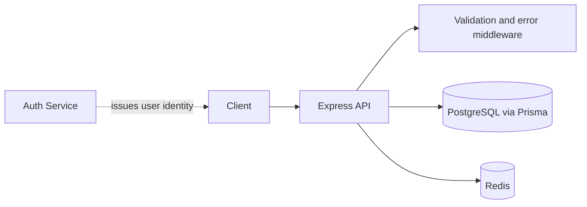

# E-Commerce API

A modular REST API for an e-commerce system built with **Express 5, TypeScript, PostgreSQL, Prisma, and Redis**.

The service owns catalog, cart, order, inventory, and payment-domain data. User identity remains owned by the separate Auth Service; this API will consume authenticated `userId` values instead of duplicating the user database.

## Current status

Implemented so far:

- Express and TypeScript project setup.
- Environment validation with Zod.
- PostgreSQL connection through Prisma 7.
- Redis connection and dependency health check.
- Initial domain schema and migration for categories, products, carts, orders, payments, and inventory movements.
- Docker Compose stack for API, PostgreSQL, and Redis.
- Dependency audit currently reports zero vulnerabilities.
- Category catalog module with public reads and admin-only create, update, and soft-delete endpoints.

Business modules are intentionally added in phases. Catalog CRUD is the first implementation phase, followed by products, cart, and checkout.

## Architecture



The target request flow is:

```text
Route → Middleware → Controller → Service → Repository/Prisma → PostgreSQL
                                      └──────────────→ Redis / BullMQ (later)
```

This is a modular monolith. Payment gateway integration, BullMQ workers, and external email delivery are planned after the catalog, cart, and checkout flows are stable.

## Tech stack

| Area | Technology |
| --- | --- |
| Runtime / language | Node.js 24, TypeScript |
| HTTP API | Express 5 |
| Database / ORM | PostgreSQL 16, Prisma 7 |
| Cache and queue backing store | Redis 7 |
| Validation | Zod 4 |
| Local infrastructure | Docker Compose |

## Quick start with Docker Compose

Requirements: Docker Desktop with Compose.

Create a local environment file if one does not exist:

```powershell
if (-not (Test-Path .env)) { Copy-Item .env.example .env }
```

Start the stack:

```powershell
docker compose up --build
```

The API is available at `http://localhost:3001`. The host ports are API `3001`, PostgreSQL `5434`, and Redis `6381`. These ports avoid the Auth Service and Laragon ports used elsewhere on the development machine. The app waits for PostgreSQL and Redis health checks, applies committed migrations, and starts.

Check readiness:

```powershell
Invoke-RestMethod http://localhost:3001/health | ConvertTo-Json -Depth 5
```

Stop the stack while preserving its database volume:

```powershell
docker compose down
```

`docker compose down -v` deletes the Compose PostgreSQL volume and its data. Use it only when intentionally resetting this project database.

## Local development with Laragon PostgreSQL

1. Create a PostgreSQL database named `ecommerce_api` in Laragon.
2. Start Redis on `localhost:6379`, or update `REDIS_URL` in `.env`.
3. Copy `.env.example` to `.env` and set the local connection strings.
4. Install dependencies and prepare Prisma:

   ```powershell
   npm ci
   npm run db:generate
   npm run db:migrate
   ```

5. Start the development server:

   ```powershell
   npm run dev
   ```

## Domain model

- `Category` and `Product` represent the catalog.
- `CartItem` stores a user's current cart and enforces one row per user/product pair.
- `Order` and `OrderItem` represent checkout history. Order items snapshot product name and price so historical orders do not change when the catalog changes.
- `Payment` tracks payment-provider state and stores raw provider responses as JSON.
- `InventoryMovement` provides an auditable history for stock changes and future reservations/releases.
- `userId` is a UUID reference to the Auth Service identity; no duplicate `User` table is maintained here.

## Category API

Public endpoints:

| Method | Endpoint | Purpose |
| --- | --- | --- |
| `GET` | `/api/categories` | List active categories with search and pagination |
| `GET` | `/api/categories/:slug` | Get one active category |

Admin endpoints require a Bearer access token issued by the Auth Service and a user with the `ADMIN` role:

| Method | Endpoint | Purpose |
| --- | --- | --- |
| `POST` | `/api/categories` | Create a category; slug is generated when omitted |
| `PUT` | `/api/categories/:id` | Update category name or slug |
| `DELETE` | `/api/categories/:id` | Soft-delete a category |

The API verifies the Auth Service JWT using the same local `JWT_ACCESS_SECRET`. In a deployed environment, keep this secret synchronized through a secret manager rather than committing it.

## Planned API modules

| Module | Planned responsibility |
| --- | --- |
| Products | CRUD, search, filters, sorting, pagination, cache invalidation |
| Cart | Add, update, remove, and clear items |
| Orders | Checkout, stock locking, order history, cancellation |
| Payments | Mock provider first, then sandbox webhook with idempotency |
| Admin orders | Order listing and status transitions |
| Jobs | BullMQ invoice and notification workers |

Checkout will use a PostgreSQL transaction and row-level locking (`SELECT ... FOR UPDATE`) so concurrent checkouts cannot oversell stock. Payment webhooks will be idempotent because providers may retry the same event.

## Verification

```powershell
npm run typecheck
npm run build
npm audit
```

The initial foundation has no business endpoint tests yet; integration tests will be added with the first catalog and checkout modules.

## Environment variables

See `.env.example`. Never commit `.env`, database credentials, payment credentials, or webhook secrets.

## Security scope

Before exposing the service publicly, use HTTPS, production-grade secrets, restricted database access, authentication middleware connected to the Auth Service, webhook signature verification, request rate limits, backups, and monitoring. Payment gateway credentials and email credentials must remain server-side.

## License

No license has been selected yet. Until a `LICENSE` file is added, do not assume others have permission to reuse or redistribute this code.
